# SalarySabi holistic alignment audit

Date: 21 August 2026
Scope: representative live production routes at desktop and 390px mobile widths
Lens: the frozen SalarySabi product model, Laws of UX, and Refactoring UI principles

## Verdict

SalarySabi already matches as a **visual family**, but only partially matches as a **single product**.

The pages consistently use the same typography, green palette, restrained surfaces, square geometry, strong headings, and direct language. Responsive behavior is healthy: the thirteen captured states had one main landmark and no horizontal overflow.

The remaining mismatch is structural. The site still presents itself through `For me`, `For my business`, and `Learn about PAYE`, while the frozen homepage model describes three clearer outcomes:

1. Calculate and verify pay.
2. Compare and improve pay.
3. Hire and pay people.

The public routes therefore feel like polished utilities sharing a logo rather than one guided SalarySabi system. This is fixable without changing the visual identity.

## Frozen platform model

`Know what you earn, what you owe and what you keep` is the employee pay journey:

- **Earn:** gross salary, market salary ranges, and jobs with published pay.
- **Owe:** PAYE and eligible deductions.
- **Keep:** take-home pay after deductions.

Employer tools are a separate but related promise: **hire transparently and pay people correctly**.

Rewards are the data-acquisition loop that makes salary and job transparency possible. They should be visible and attractive, but they are not a fourth product pillar.

## Experience health

| Step | Surface | Health | Why |
|---|---|---|---|
| 1 | Shared navigation | Needs correction | `For me` does not distinguish pay tools from jobs and salaries; `Learn about PAYE` is narrower than the actual learning and trust content. |
| 2 | Salaries and jobs hub | Mixed | The two primary cards are clear; `Track applications` is visually orphaned and the contribution links lack context. |
| 3 | Salary comparison | Mixed | The privacy threshold and fallback actions are honest and useful, but the reward card becomes the visual peak while comparison data is empty. |
| 4 | Jobs with salaries | Mostly healthy | Salary, source, status, and application path are transparent. Aggregator-sourced jobs must remain explicitly lower confidence than employer-published listings. |
| 5 | Payslip checker | Mixed | The form is focused but feels standalone; it lacks an opening outcome, trust cue, and next-step bridge. |
| 6 | Business hub | Mostly healthy | The three employer tasks are clear and responsibility is stated. It needs the shared employer promise and terminology. |
| 7 | Payroll entry | Mostly healthy | The task, account boundary, privacy statement, and responsibility are clear. The pre-auth feature tabs look actionable before sign-in. |
| 8 | PAYE guide | Healthy | Strong question-led information architecture, direct calculator handoff, and visible source/update access. |
| 9 | Contributor programme | Mixed | The funded offers and approval process are clear, but `Earn ₦1,000` leads before the public benefit and can make the product feel transactional. |
| 10 | About and trust | Mixed | Founder accountability and calculation methodology are strong; `Pay and tax, explained clearly` omits salary data, jobs, and employer tools. |
| 11 | Mobile structure | Mostly healthy | No overflow and card stacking is predictable; the header retains the same ambiguous taxonomy and the large footer can outweigh sparse page content. |

## Evidence

### 1. Jobs and salaries are understandable, but not yet one guided journey

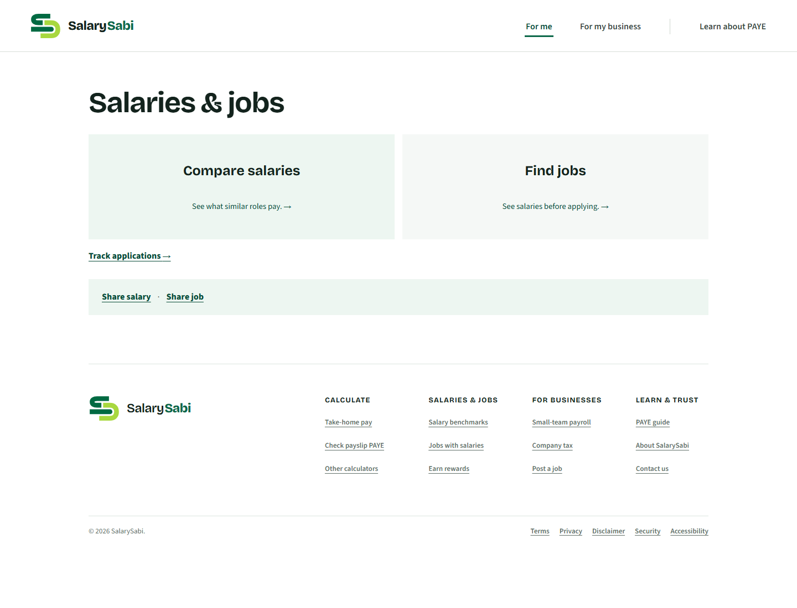

The two large choices follow Hick's Law well. The smaller `Track applications`, `Share salary`, and `Share job` actions use three different treatments, weakening hierarchy and grouping. Make the hub a complete progression: **Compare pay → Find jobs → Track applications**, then place contribution actions in a clearly labelled transparency strip.

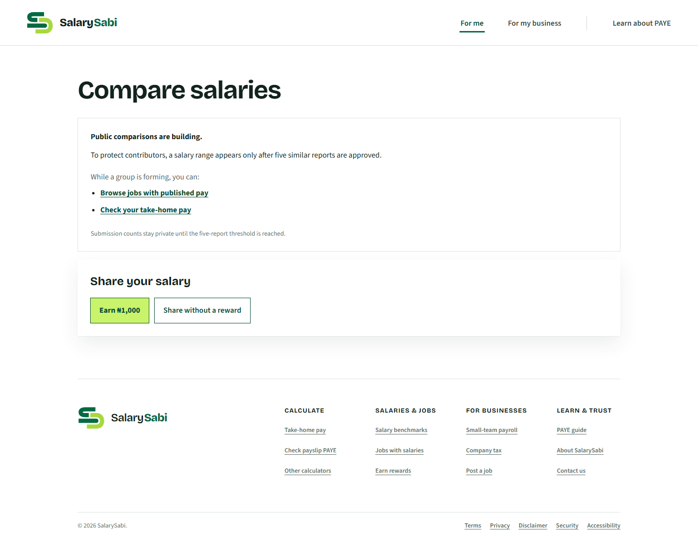

The empty state protects contributors and offers real alternatives. Keep that. Its next refinement is to show what a published range will contain and to frame contribution as helping unlock comparisons before promoting the cash reward.

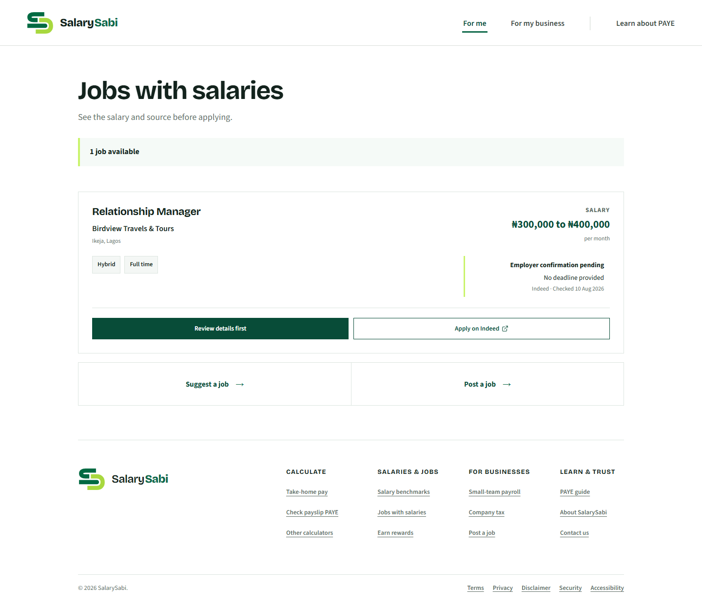

The job card is a strong example of SalarySabi's trust model: offered pay, source, last check, and confidence state are visible before application. Use `Employer-published`, `Source-reported`, and `Community-submitted` as consistent labels across jobs, contributions, and admin review.

### 2. Pay tools share a topic but do not yet share a flow

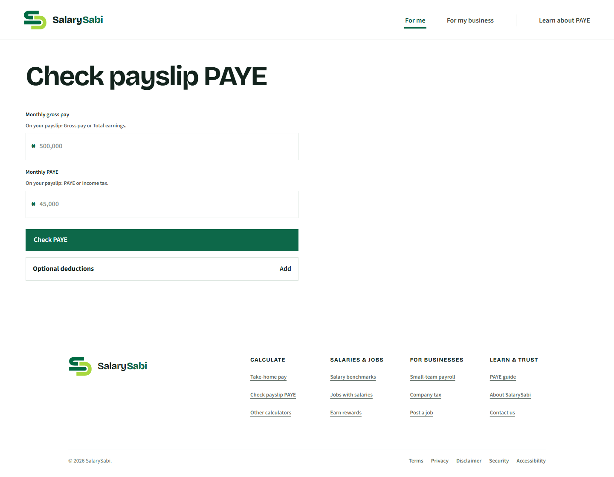

The checker needs one sentence explaining the outcome, a visible privacy/freshness cue, and a post-result route to `Understand the difference`, `Recalculate take-home pay`, or `Compare my salary`. The empty right side on desktop can hold this reassurance without adding clutter.

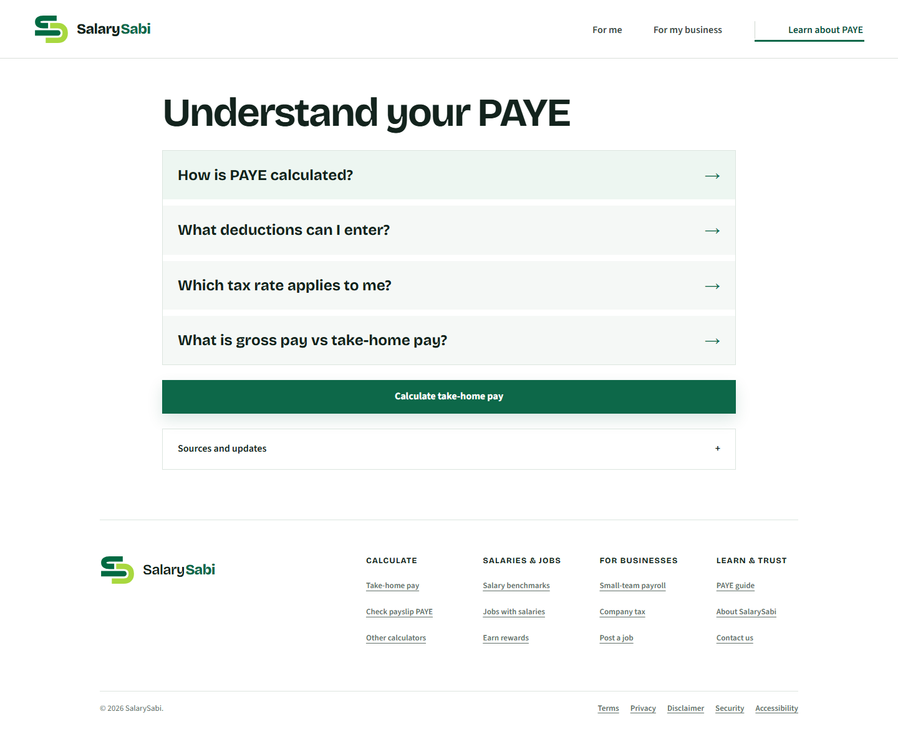

The guide is the strongest information hub. Its question-first structure, restrained hierarchy, and calculator CTA should become the pattern for supporting education elsewhere.

### 3. Employer tools form a coherent family, but need a clearer platform promise

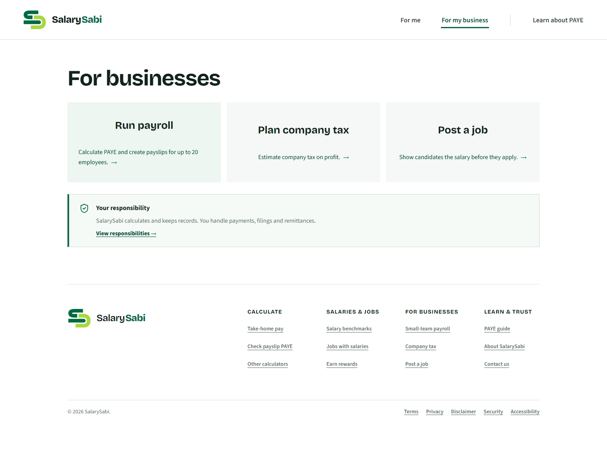

The three employer tasks are distinct and the responsibility notice is valuable. Rename the shared destination `For employers`, introduce it with `Hire transparently and pay people correctly`, and retain the task descriptions on all widths.

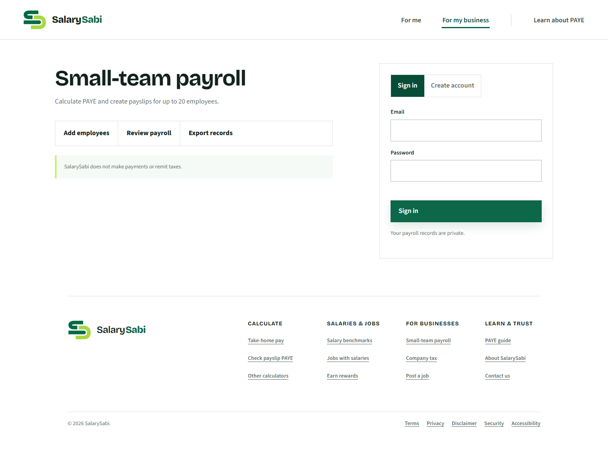

Before authentication, `Add employees`, `Review payroll`, and `Export records` read like available controls. Present them as a short feature list or disable them with a clear `Sign in to use payroll` explanation so the interface cannot imply a false state.

### 4. Contributions are a growth engine, not the definition of SalarySabi

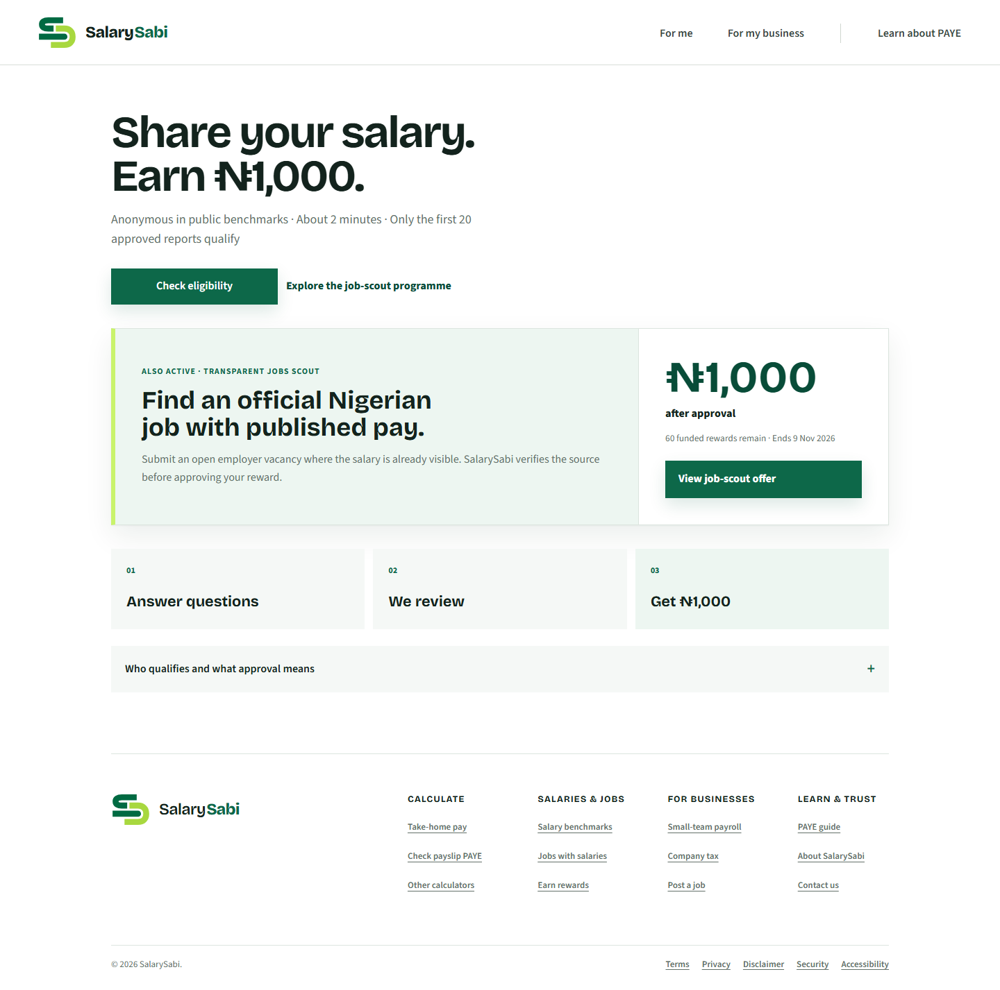

Lead with `Help make Nigerian pay transparent`, then state the funded reward. Keep the amount prominent inside each active offer, alongside remaining slots, deadline, approval criteria, and anti-fraud rules. This preserves motivation while increasing legitimacy and trust.

### 5. Trust content must describe the whole platform

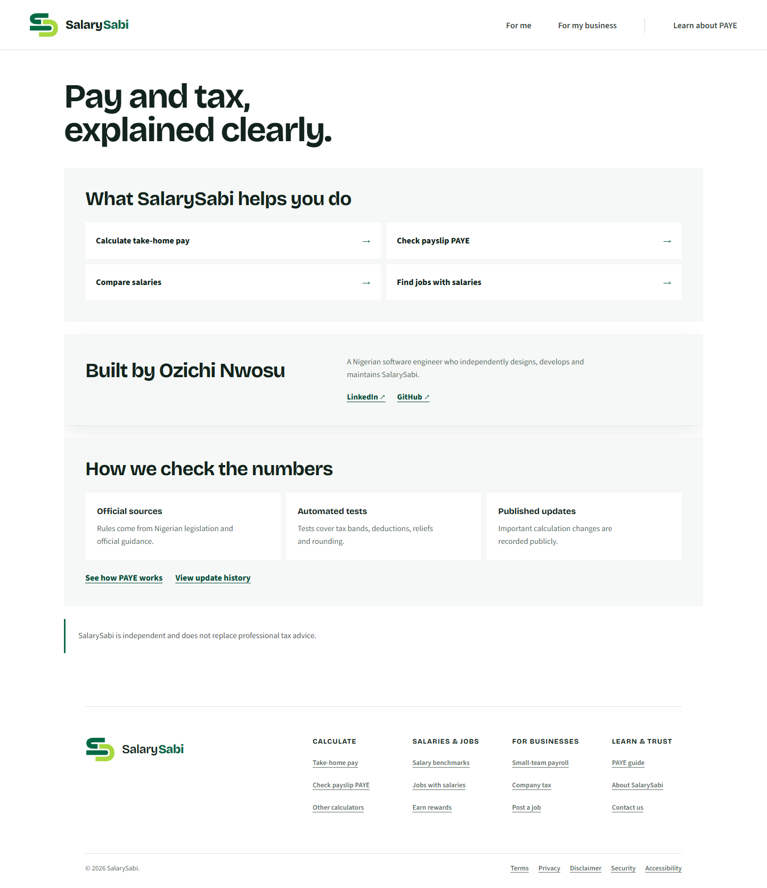

The current page proves calculation credibility but describes only part of the product. Change its opening proposition to include pay understanding, salary transparency, jobs with published pay, and responsible employer tools. Preserve the founder and methodology sections.

### 6. Mobile is stable, but shared taxonomy remains the limiting factor

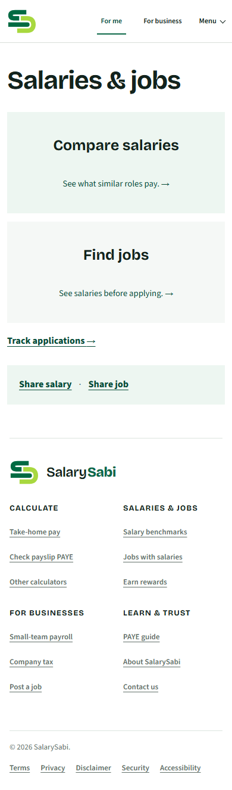

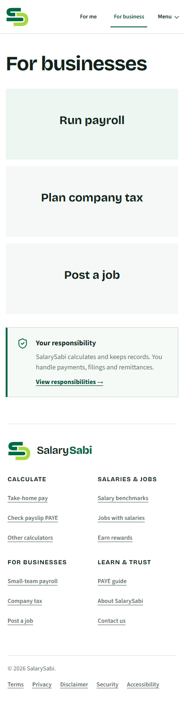

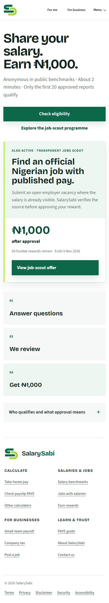

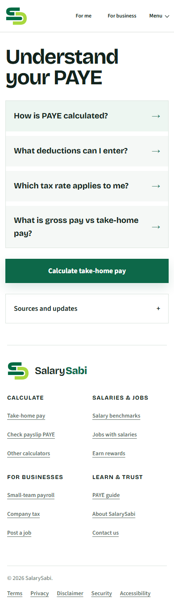

The layouts stack cleanly and preserve readable targets. The main mobile issue is not layout breakage; it is information scent. `For me` and `Menu` make users inspect navigation to discover the two major employee jobs: pay tools and jobs/salaries.

## Site-wide architecture to lock

### Primary navigation

- **Pay & tax** — take-home calculator, payslip checker, PAYE guide, deductions, tax bands.
- **Jobs & salaries** — salary comparison, jobs with published pay, application tracking.
- **For employers** — payroll, company tax, post a job.
- **Learn** — PAYE guide, methodology, update history, about, contact.

Contributions should appear as a campaign announcement, contextual CTA, and account destination—not as a competing product pillar.

### Shared page pattern

Every primary page should use the same five-part pattern where relevant:

1. Outcome-led H1 and one-sentence promise.
2. Main task or decision.
3. Visible trust cue: source, freshness, privacy, or responsibility.
4. One logical next step from the SalarySabi journey.
5. Footer for broad discovery, not as the only cross-product navigation.

### Language rules

- Use `pay` for the full employee experience; use `salary` when discussing gross compensation or market data.
- Use `take-home pay` as the primary label, with `net pay` as explanatory copy.
- Use `jobs with published pay`, not generic `jobs`.
- Use `For employers`, not `For my business` or `For businesses` in shared navigation.
- Distinguish `official employer source`, `source-reported`, and `community-submitted` everywhere.
- Explain that rewards are `funded`, `limited`, and `paid after approval` wherever an amount is shown.

## Required changes before calling the homepage final

1. Replace the shared header taxonomy across desktop and mobile.
2. Add contextual next steps to the calculator, payslip checker, salary comparison, jobs, payroll, and contributor completion states.
3. Normalize the jobs-and-salaries hub into three equal user outcomes and a separate contribution strip.
4. Reframe the contributor page around the transparency mission, while retaining the reward as the conversion mechanism.
5. Expand About's opening promise to cover employees, jobseekers, and employers.
6. Normalize source-confidence language across jobs, contributors, and admin.
7. Treat the footer as secondary navigation and keep it visually subordinate on sparse pages.

## Accessibility scope

The captured pages had one main landmark and no horizontal overflow at the audited widths. This audit evaluates visible hierarchy, grouping, labels, and responsive presentation. It is not a replacement for a full keyboard, screen-reader, zoom, form-error, or browser compatibility audit.

## Final decision

Do not redesign the individual page visual style. It already belongs to SalarySabi. Implement the shared architecture, terminology, trust cues, and cross-route handoffs together with the frozen homepage. Once those changes land, the site will read as one connected platform rather than several adjacent tools.
