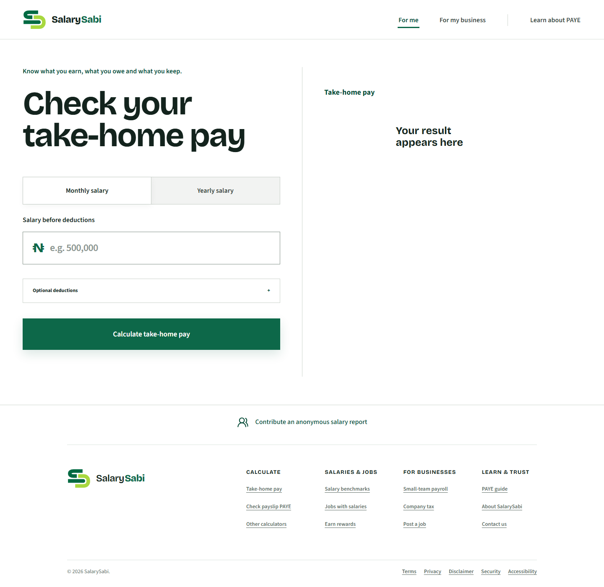
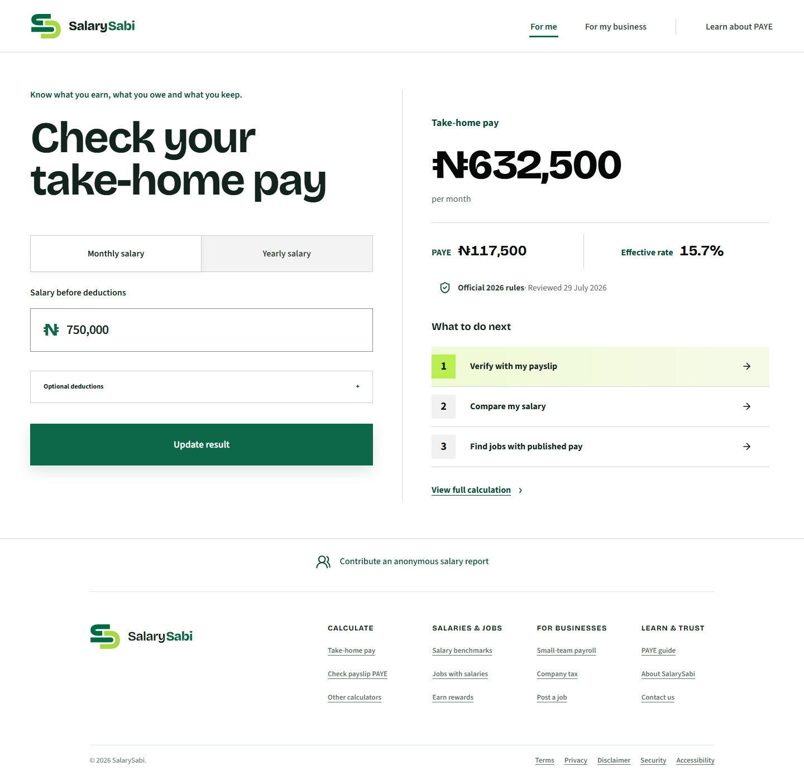
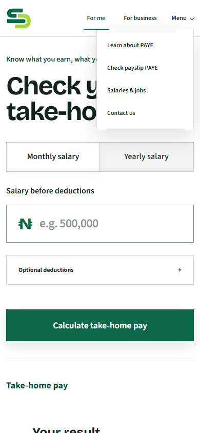
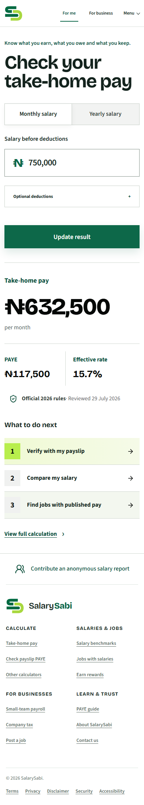

# SalarySabi homepage freeze audit

Definitive pre-implementation audit of the live production homepage, captured 21 August 2026 at desktop and mobile sizes.

## Final verdict

The homepage has an excellent calculator hero and a strong post-calculation journey. It does not yet work as the homepage of the complete SalarySabi platform because the broader value is visible only after calculation, inside navigation, or in the footer.

The redesign must preserve the calculator and result hierarchy while exposing the platform's three paths before interaction.

## Evidence and health

### Step 1 — Desktop initial state

Health: Mixed.

The task, input and primary action are immediately clear. The empty result panel consumes almost half the hero without explaining its future contents or the wider platform. A first-time visitor sees a take-home-pay calculator, not a connected pay-and-work product.

### Step 2 — Desktop calculated result

Health: Healthy.

This is the strongest homepage state. Take-home pay is the visual peak; PAYE, effective rate, official-rule freshness and next actions follow naturally. “Verify with my payslip → Compare my salary → Find jobs with published pay” is the correct connected employee journey. It should become the homepage's visible mental model before calculation, not remain a reward for discovering the calculator first.

### Step 3 — Mobile initial state

Health: Mixed.

The form reflows clearly. The empty result becomes a large low-value vertical block. Salary, jobs, learning and employer tools remain below the contribution prompt in the footer.

### Step 4 — Mobile navigation

Health: Needs clarification.

“For me” is vague, “For business” uses a different audience label, and “Salaries & jobs” is hidden under Menu even though it is a core product area. The structure combines audience navigation and product navigation without a consistent rule.

### Step 5 — Mobile calculated result

Health: Healthy.

The numerical hierarchy, trust marker and numbered next actions are clear. The result is long but every block contributes useful information. This sequence should be preserved.

## Locked brand model

“Know what you earn, what you owe and what you keep” describes an individual's pay journey:

- Know what you earn: gross pay, market salary ranges and roles offering published pay.
- Know what you owe: PAYE and eligible payroll deductions.
- Know what you keep: net or take-home pay after tax and deductions.

Employer products do not represent “what you keep.” They are a separate audience proposition: hire transparently and pay people correctly.

## Locked homepage information architecture

### Header

Use four literal destinations:

1. Pay & tax
2. Jobs & salaries
3. For employers
4. Learn

Do not use “For me,” “For my business,” or a product-level rewards navigation item. When a reward campaign is active, use a slim announcement below the header: “Earn ₦1,000 for approved pay information. See funded offers.”

### Hero

Keep:

- Eyebrow/motto: “Know what you earn, what you owe and what you keep.”
- H1: “Check your take-home pay.”
- The monthly/yearly selector, salary field, deductions and calculation button.
- The current calculated result hierarchy and its three next actions.

Add one explicit platform sentence below the H1:

“Start with your take-home pay, then verify your payslip, compare salaries and find jobs that publish what they pay.”

The empty result should say what will appear: “See your take-home pay, PAYE and effective tax rate.” On mobile, keep the empty result compact; expand it only after calculation.

### Section 2 — Three platform paths

Heading: “Everything around pay, in one place.”

1. Calculate & verify pay
   - Copy: “See your take-home pay, understand PAYE and check the tax on your payslip.”
   - Links: Take-home pay; Check payslip PAYE; Understand PAYE.
2. Compare & improve pay
   - Copy: “Compare reviewed salary ranges and find current jobs that publish what they pay.”
   - Links: Compare salaries; Jobs with salaries.
3. Hire & pay people
   - Copy: “Publish transparent roles, calculate payroll and understand company tax.”
   - Links: Post a job; Run payroll; Company tax.

These paths should use spacing and light surface contrast rather than three heavy, identical bordered cards.

### Section 3 — Funded contributions

Heading: “Help make Nigerian pay clearer.”

Explain that SalarySabi rewards approved anonymous salary reports and verified job leads—not clicks or referrals. Show the live reward only when a funded campaign is active. Primary action: “See funded offers.” Secondary action: “Track my contributions.”

### Section 4 — Trust

Heading: “Numbers you can inspect.”

Show three proofs:

- PAYE calculations tied to official rules and a visible review date.
- Salary reports reviewed and published only in anonymous groups of at least five.
- Job salaries checked against an original source and removed when stale.

Link to calculation methodology and source policy. Do not add invented testimonials, customer logos or usage counts.

### Footer

Retain the current grouped footer. It becomes secondary navigation rather than the only place where the complete product is visible.

## Audience test

- Employee: primary calculator and payslip verification are obvious.
- Job seeker: salary comparison and published-pay jobs are visible without first calculating.
- Contributor: the funded programme is understandable without overtaking the product.
- Employer: employer tools have a dedicated, literal path without being forced into the employee slogan.

## Do-not-change boundaries

- Do not replace the calculator with a generic marketing hero.
- Do not make all three paths equal to the calculator in the first viewport.
- Do not add a long founder story, blog feed, generic feature grid or speculative testimonials to the homepage.
- Do not put rewards in primary navigation.
- Do not force employer tools into “what you keep.”
- Do not weaken the calculated result's numerical hierarchy or numbered next actions.
- Do not show fake salary or job data merely to make the page look populated.

## Five-second acceptance test

After implementation, a new visitor must be able to answer:

1. What is this? A Nigerian pay, salary and transparent-jobs platform.
2. What can I do first? Calculate my take-home pay.
3. What else can I do? Verify, compare, find published-pay jobs, or use employer tools.
4. Why trust it? Official rules, reviewed evidence and visible privacy thresholds.

## Accessibility verification still required after implementation

The screenshots confirm visible hierarchy and responsive reflow only. The implementation pass must re-test heading order, menu semantics, keyboard order, focus visibility, target size, dynamic result announcement, contrast and 200% zoom. No screenshot-only audit can certify WCAG compliance.
