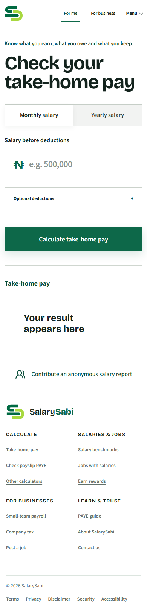

# SalarySabi homepage positioning audit

Captured from the live production homepage on 21 August 2026.

## Evidence

### Step 1 — Desktop first impression

Health: Mixed.

The calculator is focused, credible and immediately usable. However, almost the entire homepage is the calculator. Salary benchmarks, salary-published jobs, payslip checking, employer payroll, company tax and job posting are discoverable only through navigation or footer links. A first-time visitor would reasonably describe SalarySabi as a Nigerian take-home-pay calculator rather than a broader pay-and-work platform.

### Step 2 — Mobile first impression

Health: Mixed.

The calculator reflows cleanly and no horizontal overflow is visible. The empty result takes substantial vertical space before the only secondary proposition, “Contribute an anonymous salary report.” The broader product is again relegated to the footer, which most first-time visitors will not use to construct the platform’s purpose.

## Verdict

The homepage is polished but not positionally complete. It communicates the calculator extremely well and the complete SalarySabi product poorly.

The slogan should describe the employee pay journey:

- Know what you earn: gross pay, market salary ranges and jobs with published salaries.
- Know what you owe: PAYE and eligible deductions.
- Know what you keep: take-home pay after tax and deductions.

“What you keep” does not naturally mean business tools. Employer payroll, company tax and job posting are a separate audience promise: hire transparently and pay people correctly.

## Recommended homepage model

Keep the calculator as the hero and primary entry point. Immediately beneath it, show three outcome-led platform paths:

1. Calculate and verify my pay — take-home calculator, payslip PAYE checker and PAYE guidance.
2. Compare and improve my pay — salary benchmarks, jobs with published salaries and funded contributions.
3. Hire and pay people — post a transparent job, run payroll and plan company tax.

Use an explicit platform sentence near the hero, such as: “Calculate your take-home pay, check your payslip, compare salaries and find jobs that publish what they pay.” Keep the employer path visible below, without forcing it into the employee slogan.

## Accessibility evidence limits

The screenshots confirm responsive reflow and visible text hierarchy only. They do not establish keyboard behavior, focus order, accessible names, screen-reader output, zoom resilience or color-contrast ratios.
