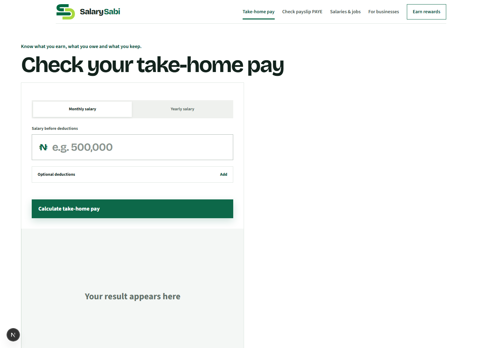
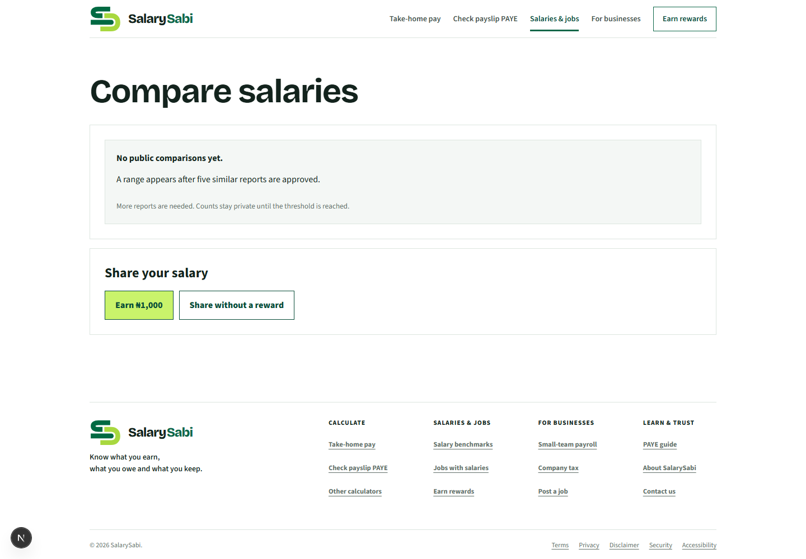
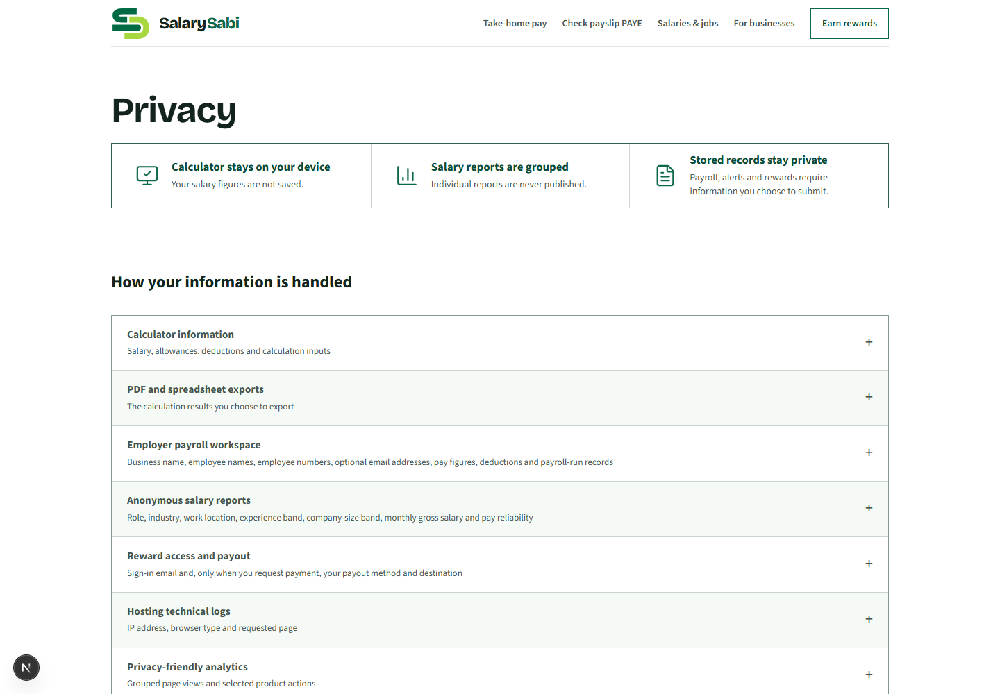
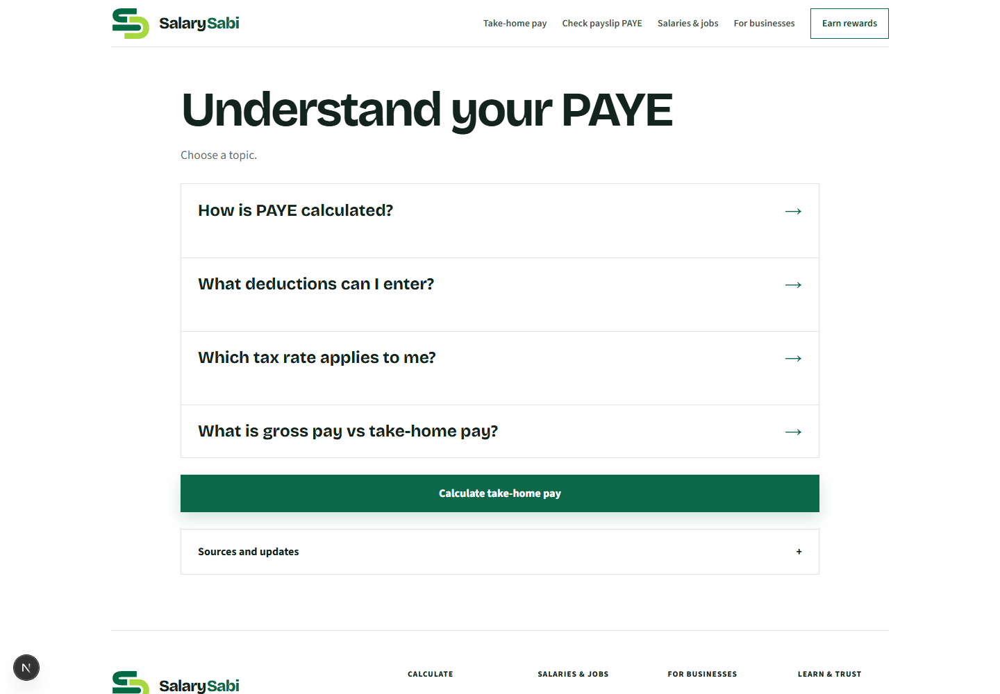
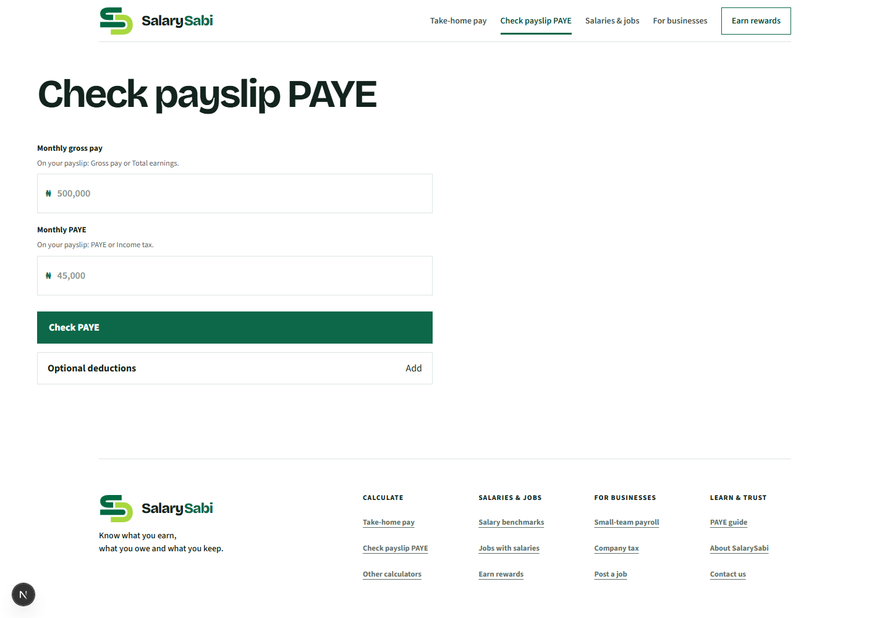
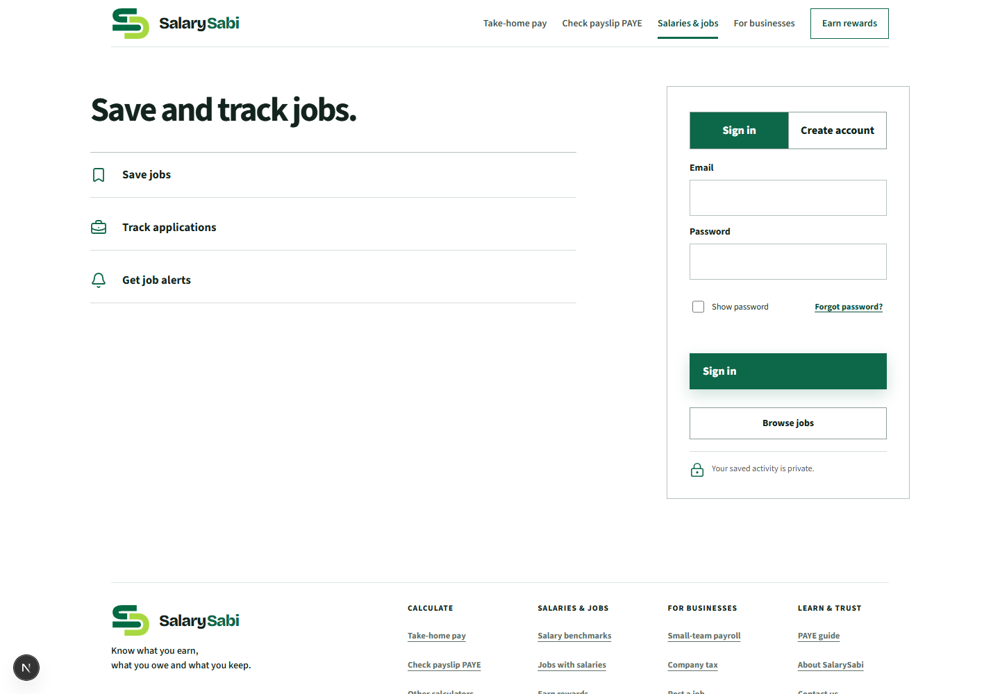
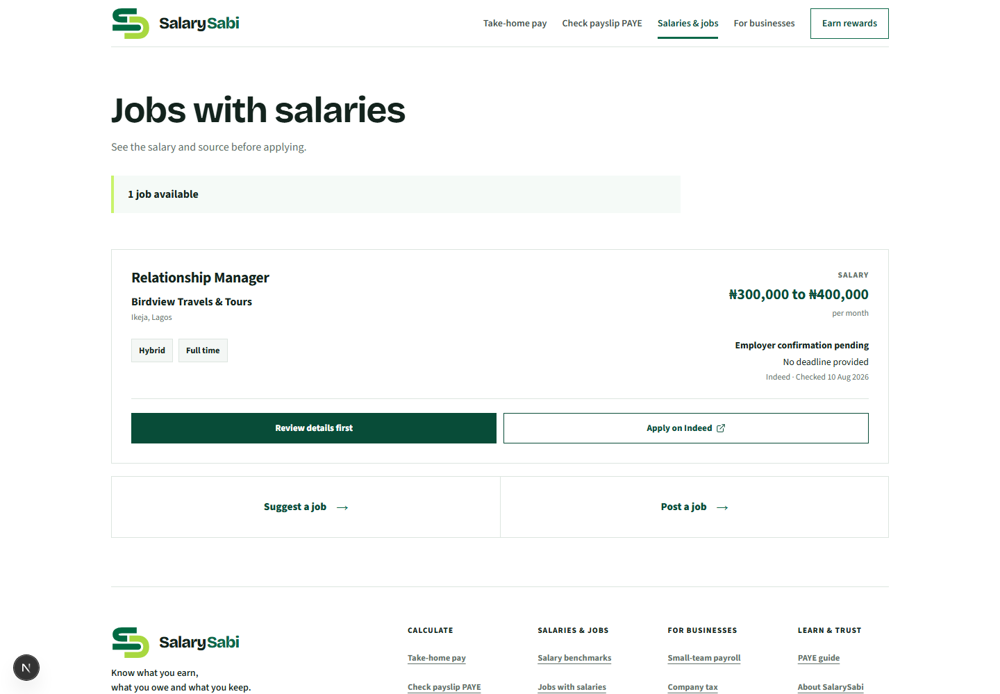
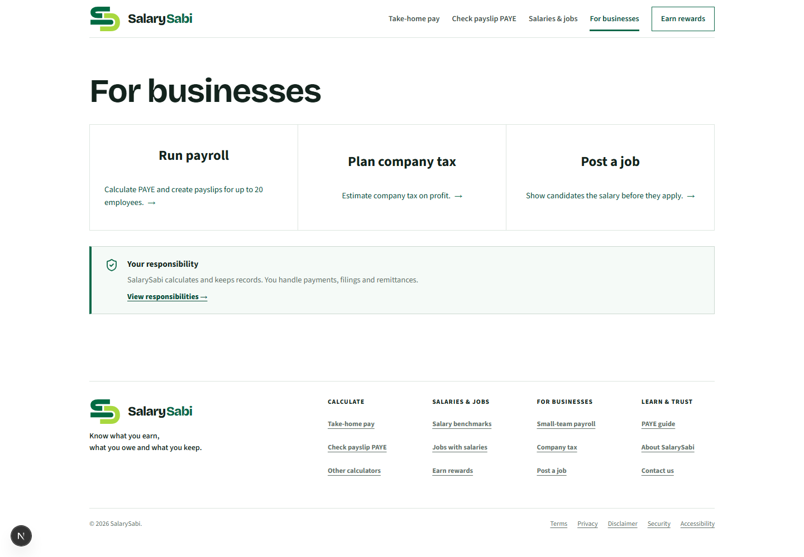
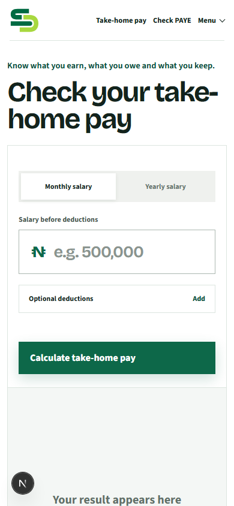
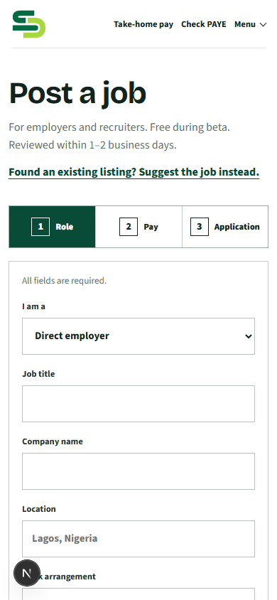

# SalarySabi — Refactoring UI sitewide audit

Date: 19 August 2026
Scope: 18 current-state screenshots across the core consumer, job, business, learning, trust, and mobile experiences.
Lens: hierarchy, layout and spacing, typography, color, depth, imagery/icons, component consistency, and responsive composition.

## Overall verdict

SalarySabi has a strong, recognizable foundation: a restrained Nigerian-green palette, distinctive display typography, plain-language tasks, consistent navigation, and unusually clear forms. It now feels trustworthy and functional.

It does not yet feel fully polished as one visual product. The dominant pattern is **large heading + white canvas + bordered rectangle**. That repetition makes unrelated screens feel similar, but it also flattens hierarchy, creates a spreadsheet-like texture, and leaves large areas of desktop space unresolved. The next leap is not more copy reduction. It is a tighter visual system with fewer borders, a broader weight/contrast range, clearer surface hierarchy, and deliberate empty-state composition.

Current visual-system health: **7/10 — strong foundation, one focused refinement pass away from feeling finished.**

## Strengths

- Brand recognition is immediate. The logo, deep green, lime accent, and display face work together.
- Primary actions are generally obvious and large enough.
- Most pages respect a shared content width and a predictable header/footer shell.
- Copy is concise enough that visual hierarchy can do real work.
- Forms use visible labels rather than placeholders alone.
- Mobile reflow is structurally sound: no observed horizontal overflow at 390px.
- Job detail, privacy, and PAYE learning pages demonstrate that dense information can remain readable.

## Highest-impact findings

### 1. The homepage empty state breaks the desktop composition

The calculator occupies only the left half of a wide screen while its result placeholder drops below the form and becomes an extremely tall pale panel. The blank right half and below-fold placeholder make the page feel unfinished.

**Recommendation:** Keep the form and result side-by-side on desktop from the start. Use a compact result placeholder inside the right panel, vertically centered, with a small visual cue rather than a large empty surface. Stack them only below the tablet breakpoint.

### 2. Borders are carrying too much of the design

Nearly every card, row, footer group, accordion, form, and navigation region uses a 1px border. This technically separates elements, but it makes the interface busy and gives many pages the same rigid, spreadsheet-like texture.

**Recommendation:** Reserve borders for inputs, tables, and true containment. For ordinary groups, use one of three alternatives: spacing, a very light tinted surface, or a subtle two-part shadow. Remove outer borders when inner rows already provide structure.

### 3. Hierarchy relies too heavily on bold weight

Headlines, section titles, card titles, labels, navigation, buttons, and many links are all bold or extra-bold. The result is clear but loud: secondary information cannot recede enough, so several elements compete at once.

**Recommendation:** Define a smaller, deliberate weight system: 700 for page and section headings, 600 for controls and card titles, 500 for labels, 400 for supporting copy. Use color and spacing—not another jump in boldness—to establish secondary hierarchy.

### 4. Desktop layouts alternate between overly narrow and overly wide

The payslip checker leaves most of the right side empty, while the account page distributes a small amount of information across a very wide two-column canvas. Both are valid layouts in isolation, but the sizing logic is inconsistent.

**Recommendation:** Create three standard content measures: reading width (about 680px), form/tool width (about 920px), and data/dashboard width (about 1120px). Select one intentionally per page rather than defaulting to the widest shell.

### 5. The color system is recognizable but underdeveloped

Deep green works well for brand and primary actions. However, most surfaces are white, pale green, or outlined white, so information types and states are not visually differentiated. Lime is strongly associated with rewards but can feel like a separate mini-brand.

**Recommendation:** Formalize neutral and green scales, then add restrained semantic scales for warning, error, success, and information. Use tinted backgrounds for status and guidance instead of more borders. Keep lime limited to reward/progress moments.

### 6. Depth is inconsistent

Buttons sometimes have a soft shadow, but panels that conceptually sit above the page—login cards, forms, result cards—often use only borders. Conversely, ordinary content rows sometimes receive as much containment as interactive panels.

**Recommendation:** Establish three elevations: flat content, raised interactive panel, and floating/temporary surface. Apply shadows only where elevation communicates interaction or layering.

### 7. Card layouts need more internal hierarchy

The business and tax-tool cards are clear, but title, description, and arrow often sit in one broad horizontal row. On wide screens this produces long eye travel and weak grouping.

**Recommendation:** Keep each card’s text in a compact cluster, make the entire card clickable, and align the arrow to the cluster rather than the far edge. Vary card emphasis when one route is the likely primary task.

### 8. The mobile foundation is healthy, but long forms need stronger wayfinding

Mobile typography and fields are readable. The homepage placeholder still consumes too much vertical space, and the job form’s stepper remains visually dominant as the user scrolls away from it.

**Recommendation:** Reduce empty-state height on mobile, keep progress visible with a compact sticky step label, and use section-level spacing rather than a large outer border around the whole form.

## Step-by-step health

1. **Homepage / take-home calculator — Needs improvement.** Strong entry point and CTA; unresolved two-column empty state is the largest visual defect.
2. **Payslip checker — Mostly healthy.** Excellent clarity and restraint; desktop width is too narrow for the shell and footer arrives before the page feels compositionally complete.
3. **Salaries & jobs hub — Mostly healthy.** Choice architecture is obvious; the dark contribution bar and footer compete with the two main paths.
4. **Salary comparisons — Mostly healthy.** Empty-state copy and choices are clear; excessive nested borders make a very small amount of content feel boxed-in.
5. **Jobs list — Healthy.** Best-balanced product screen: clear card grouping, strong salary emphasis, and appropriate CTA hierarchy.
6. **Job detail — Healthy.** Strong information hierarchy and readable long-form content; repeated full-width separators can be reduced.
7. **Job workspace / sign-in — Needs improvement.** The split is understandable, but the left side is sparse and the login panel feels visually detached rather than intentionally elevated.
8. **Business hub — Mostly healthy.** Three tasks are clear; equal card weight ignores likely task priority and the wide horizontal layout weakens grouping.
9. **Post a job — Healthy.** Logical stepper and form grid; outer containment and full-width button make the panel heavier than necessary.
10. **Rewards — Mostly healthy.** Focused conversion path; headline scale and three equal process panels leave limited visual nuance.
11. **Tax-tools hub — Mostly healthy.** Clear choices; the last incomplete grid row creates an awkward empty cell and exposes the rigid grid system.
12. **PAYE guide — Healthy.** Strong scanning and task order; every question has equal emphasis and the page could use lighter secondary treatment.
13. **About — Mostly healthy.** Clear brand message and credibility; very large typography plus repeated bordered blocks creates abrupt scale changes.
14. **Privacy — Healthy.** Dense information is impressively scannable; alternating bordered rows become visually monotonous.
15. **Mobile homepage — Needs improvement.** Good field sizing and navigation; oversized empty result state pushes useful next actions far down.
16. **Mobile jobs — Healthy.** Card structure reflows well and actions remain distinct.
17. **Mobile post-job — Mostly healthy.** Readable fields and steps; long-form progress and containment need lighter treatment.
18. **Mobile privacy — Healthy.** Strong stacking and readable summaries; accordion rows could use slightly stronger tap feedback.

## Recommended implementation order

1. Repair the homepage pre-result layout at desktop and mobile.
2. Define shared type, spacing, color, radius, border, and elevation tokens with explicit usage rules.
3. Remove approximately one-third to one-half of nonessential borders.
4. Normalize page measures into reading, form, and dashboard widths.
5. Rebalance font weights and supporting-text contrast.
6. Create reusable `Card`, `Panel`, `Status`, `EmptyState`, and `SectionHeader` variants.
7. Refine hub grids so incomplete rows and low-content pages do not expose empty structural space.
8. Run a final keyboard, zoom, screen-reader, and contrast check after the visual refactor.

## Accessibility risks and evidence limits

- Text and controls generally appear legible, but screenshot review cannot confirm computed contrast ratios.
- Visible labels are a strength; keyboard order, focus visibility across every control, and screen-reader announcements require interactive testing.
- The screenshots show responsive reflow at 390px, not 200% browser zoom or all intermediate widths.
- Error recovery was not exercised across every form during this visual audit.
- No claim of WCAG conformance is made.

## Refactoring UI principle summary

The audit follows the book’s core areas: hierarchy, layout and spacing, text, color, depth, and component design. The most relevant tactic for SalarySabi is the official site’s own example: reduce unnecessary borders and distinguish elements with spacing, background contrast, or depth instead.
